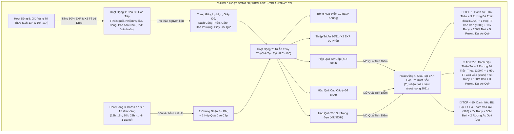

# 🎓 KẾ HOẠCH TỔNG THỂ SỰ KIỆN NGÀY NHÀ GIÁO VIỆT NAM (20/11) - GAME HTTH
# "TRI ÂN THẦY CÔ: TÔN SƯ TRỌNG ĐẠO"

---

## MỤC LỤC
1. [Tổng Quan & Ý Nghĩa Sự Kiện](#phần-1-tổng-quan--ý-nghĩa-sự-kiện)
2. [Tra Cứu Toàn Bộ Tài Nguyên & Bảng Dữ Liệu (Database)](#phần-2-tra-cứu-toàn-bộ-tài-nguyên--bảng-dữ-liệu-database)
   - [2.1. Bảng `item4` (Nguyên Liệu & Thành Phẩm Sự Kiện)](#21-bảng-item4-nguyên-liệu--thành-phẩm-sự-kiện)
   - [2.2. Bảng `danhhieu` & `fashiontemplate` (Danh Hiệu & Thời Trang)](#22-bảng-danhhieu--fashiontemplate-danh-hiệu--thời-trang)
   - [2.3. Bảng `mobs` & `boss` (Boss Sự Kiện Giờ Vàng)](#23-bảng-mobs--boss-boss-sự-kiện-giờ-vàng)
3. [Chuỗi 5 Hoạt Động Sự Kiện Liên Hoàn](#phần-3-chuỗi-5-hoạt-động-sự-kiện-liên-hoàn)
   - [Hoạt Động 1: Cần Cù Học Tập (Thu Thập Nguyên Liệu Qua Các Hoạt Động Ingame)](#hoạt-động-1-cần-cù-học-tập-thu-thập-nguyên-liệu-ingame)
   - [Hoạt Động 2: Tri Ân Thầy Cô (Chế Tạo Quà Tại NPC Sự Kiện)](#hoạt-động-2-tri-ân-thầy-cô-chế-tạo-quà-tại-npc-sự-kiện)
   - [Hoạt Động 3: Đại Chiến Boss Giờ Vàng "Lân Sư Tử" (Cơ Chế 1 Hit = 1 Dame)](#hoạt-động-3-đại-chiến-boss-giờ-vàng-lân-sư-tử)
   - [Hoạt Động 4: Đua Top Bảng Xếp Hạng "Học Trò Xuất Sắc" & Tự Nhận Thưởng](#hoạt-động-4-đua-top-bảng-xếp-hạng-học-trò-xuất-sắc)
   - [Hoạt Động 5: Giờ Vàng Tri Thức (Nhân Đôi Tỷ Lệ Rơi & X2 EXP)](#hoạt-động-5-giờ-vàng-tri-thức-x2-exp--tăng-tỷ-lệ-rơi-đồ)
4. [Hệ Thống Công Thức Chế Tạo Chi Tiết Tại NPC Sự Kiện](#phần-4-hệ-thống-công-thức-chế-tạo-chi-tiết-tại-npc-sự-kiện)
5. [Chi Tiết Phần Thưởng Mở Quà & Cơ Cấu Đua Top BXH](#phần-5-chi-tiết-phần-thưởng-mở-quà--cơ-cấu-đua-top-bxh)
6. [Cơ Chế Kỹ Thuật, Lưu Trữ Dữ Liệu & Chống Nhận Trùng Lặp](#phần-6-cơ-chế-kỹ-thuật-lưu-trữ-dữ-liệu--chống-nhận-trùng-lặp)
7. [Cơ Chế Bật/Tắt Sự Kiện & Hệ Thống Lệnh Quản Trị GM Ingame](#phần-7-cơ-chế-bật-tắt-sự-kiện--hệ-thống-lệnh-quản-trị-gm-ingame)

---

## PHẦN 1: TỔNG QUAN & Ý NGHĨA SỰ KIỆN

* **Tên Sự Kiện:** **TRI ÂN THẦY CÔ - TÔN SƯ TRỌNG ĐẠO**
* **Chủ đề:** Chào mừng Ngày Nhà Giáo Việt Nam 20/11.
* **Thời gian diễn ra:** Kéo dài xuyên suốt mùa lễ 20/11 (Cấu hình Bật/Tắt linh hoạt qua config).
* **Bối cảnh & Mục tiêu:**
  > Nhằm tôn vinh truyền thống "Tôn Sư Trọng Đạo" và tri ân những người thầy đã dẫn dắt các tân thủ trên hành trình Đại Hải Trình. Sự kiện được thiết kế liên hoàn, kết hợp chặt chẽ với toàn bộ các tính năng cốt lõi của game: từ train quái dã ngoại, làm nhiệm vụ lặp hàng ngày, hoạt động bang hội, vượt phó bản Nami & Mr.3, thử thách Vệ Thần Wipper, tham gia Đấu trường PvP cho đến săn Boss Giờ Vàng.
* **Nguyên tắc kỹ thuật:**
  * **100% sử dụng Item & Tài nguyên có sẵn trong database (`htth.sql`)**, bảo đảm không lỗi hiển thị, không crash client.
  * **Đã loại bỏ hoàn toàn item 591 (`Cành hoa 20.10`)** và thay thế bằng `Cánh Hoa Phượng` (ID 196).
  * **Sử dụng chính xác `Rương đá thần thoại tự chọn` (Item 4 ID 1004)** và **`Hộp thời trang cao cấp` (Item 4 ID 1002)** cho phần thưởng Đua Top.

---

## PHẦN 2: TRA CỨU TOÀN BỘ TÀI NGUYÊN & BẢNG DỮ LIỆU (DATABASE)

### 2.1. Bảng `item4` (Nguyên Liệu & Thành Phẩm Sự Kiện)

| ID Item | Tên Hiển Thị Trong DB | Icon | Phân Loại | Vai Trò & Cách Thức Hoạt Động Trong Sự Kiện |
|:---:|:---|:---:|:---|:---|
| **451** | `Trang Giấy` | 402 | Nguyên liệu | Thu thập từ đánh quái thường ($\pm 10$ cấp độ). Dùng làm Điểm 10 & Thiệp Tri Ân. |
| **461** | `Lọ mực` | 412 | Nguyên liệu | Nhận từ trả Nhiệm Vụ Lặp hằng ngày. Dùng làm Điểm 10 & Thiệp Tri Ân. |
| **452** | `Sách công thức` | 403 | Nguyên liệu | Nhận từ Nhiệm Vụ Băng, Phó Bản Băng & Vệ Thần Wipper. Dùng nâng cấp Hộp Quà Cao Cấp. |
| **196** | `Cánh Hoa Phượng` | 153 | Nguyên liệu | Thu thập từ đánh quái ($\pm 10$ level) & Nhiệm Vụ Băng. Dùng ghép Lẵng Hoa Tri Ân. |
| **575** | `Giấy gói quà` | 551 | Nguyên liệu | Nhận từ Vận Buôn Đường Biển, Phó bản Nami & Mr.3. Dùng ghép Lẵng Hoa Tri Ân. |
| **636** | `Giấy đỏ` | 104 | Nguyên liệu | Nhận từ Nhiệm Vụ Lặp hàng ngày. Dùng làm Thiệp Tri Ân & Lẵng Hoa Tri Ân. |
| **590** | `Gấu bông` | 564 | Nguyên liệu | Nhận từ Thử Thách Vệ Thần Wipper & Phó Bản Nami. Dùng ghép Hộp Quà Cao Cấp. |
| **179** | `Bản nhạc kích lệ` | 139 | Nguyên liệu | Nhận từ Đấu Trường Ms Gym, Lôi Đài PvP, Boss Truy Nã. Dùng ghép Hộp Quà Đặc Biệt. |
| **627** | `Chứng nhận sư phụ`| 591 | Nguyên liệu quý | Nhận độc quyền từ Đòn kết liễu (Last Hit) Boss Lân Sư Tử Giờ Vàng. Dùng ghép Hộp Quà Đặc Biệt. |
| **319** | `Điểm 10` | 273 | Thành phẩm | Ghép tại NPC. Sử dụng nhận EXP + Beri + **Ngẫu nhiên 1 trong các quà:** Mai rùa (6) / Bột vàng (4) / Ngôi sao (5) / Bột than-tím (2, 3). |
| **382** | `Thiệp mời` (Thiệp Tri Ân)| 339 | Thành phẩm | Ghép tại NPC. Sử dụng nhận **Ngẫu nhiên 1 Đá Khảm Cấp 5 - 6**. |
| **592** | `Hộp quà số 1` (Lẵng Hoa)| 566 | Thành phẩm | Ghép từ Cánh Hoa Phượng + Giấy Đỏ + Giấy Gói Quà. Nguyên liệu ghép Hộp Quà Sơ Cấp. |
| **586** | `Hộp qua sơ cấp` | 559 | Hộp quà | Ghép từ Điểm 10 + Thiệp + Lẵng Hoa. Mở nhận **ngẫu nhiên 1 quà:** Beri / Ruby / Đá khảm 3-4 / Bột vàng-Bùa / Rương Cam / Khiên / Búa sơ cấp / Búa đục DIAL + **1 Điểm BXH**. |
| **587** | `Hộp quà cao cấp` | 560 | Hộp quà | Ghép từ Quà Sơ Cấp + Gấu Bông + Sách. Mở nhận **ngẫu nhiên 1 quà:** Beri / Ruby / Đá khảm 5-6 / Đá Hải Thạch 3-4 / Thẻ đổi tên / Tiến cấp đơn-Kỹ năng đơn / Khiên / Búa sơ cấp / Búa đục DIAL + **3 Điểm BXH**. |
| **596** | `Hộp quà đặc biệt` | 566 | Hộp quà VIP | Ghép từ Quà Cao Cấp + Bản Nhạc + Chứng Nhận. Mở nhận **ngẫu nhiên 1 quà:** Beri / Ruby / Đá khảm 6 tự chọn / Đá Vô Cực S / Đá Hải Thạch 5-6 / Bảo hiểm chuyển hóa cao / Trái Ác Quỷ (87/158) + **5 Điểm BXH**. |
| **1004**| `Rương đá thần thoại tự chọn`| 172 | Rương Đua Top | Mở ra menu popup cho phép **tự chọn 1 trong 36 loại Đá Thần Thoại** (ID 647 đến 682). |
| **1002**| `Hộp thời trang cao cấp` | 187 | Rương Đua Top | Mở ra nhận trang phục thời trang cao cấp vĩnh viễn trong game. |
| **326** | `Đá khảm vô cực S` | 280 | Đá Đua Top | Đá khảm thần cấp cộng chỉ số sức mạnh cực lớn cho trang bị. |
| **158** | `Rương đại ác quỷ` | 112 | Rương Đua Top | Mở nhận Trái Ác Quỷ Thượng Cấp ngẫu nhiên. |
| **29**  | `Rương ác quỷ` | 112 | Rương Đua Top | Mở nhận Trái Ác Quỷ Trung Cấp ngẫu nhiên. |

---

### 2.2. Bảng `danhhieu` & `fashiontemplate` (Danh Hiệu & Thời Trang)

| ID | Loại Tài Nguyên | Tên Hiển Thị | Thuộc Tính / Công Dụng | Nguồn Đạt Được |
|:---:|:---:|:---|:---|:---|
| **67** | Danh hiệu | **Đại Thần** | Tăng mạnh toàn bộ thuộc tính chiến đấu (Vĩnh viễn) | Thưởng Quán Quân **TOP 1** Đua Top 20/11 |
| **68** | Danh hiệu | **Thiên Tử** | Tăng toàn diện chỉ số công & thủ (Vĩnh viễn) | Thưởng **TOP 2 - 3** Đua Top 20/11 |
| **64** | Danh hiệu | **Bất Bại** | Tăng tỷ lệ miễn thương & phòng ngự | Thưởng **TOP 4 - 10** Đua Top 20/11 |
| **1002**| Item4 / Box | **Hộp thời trang cao cấp** | Mở nhận trang phục thời trang cao cấp vĩnh viễn | Thưởng TOP 1 và TOP 2 - 3 Đua Top 20/11 |

---

### 2.3. Bảng `mobs` & `boss` (Boss Sự Kiện Giờ Vàng)

| Mob ID | Tên Boss | Bảng DB | Level | HP Cơ Bản | Cơ Chế Sát Thương & Xuất Hiện | Phần Thưởng Tiêu Diệt |
|:---:|:---|:---:|:---:|:---|:---|:---|
| **153** | **Boss Lân Sư Tử** | `mobs` / `boss` | 99 | 100,000,000 HP | • Xuất hiện lúc **12h, 18h, 20h, 22h** tại map ngẫu nhiên.<br>• **Cơ chế: 1 Hit = 1 Dame (trừ đúng 1 HP/đòn đánh)**. | **Đòn kết liễu (Last Hit):**<br>• 2 `Chứng Nhận Sư Phụ` (627)<br>• 1 `Hộp Quà Cao Cấp` (587) |

---

## PHẦN 3: CHUỖI 5 HOẠT ĐỘNG SỰ KIỆN LIÊN HOÀN



---

### HOẠT ĐỘNG 1: CẦN CÙ HỌC TẬP (THU THẬP NGUYÊN LIỆU INGAME)

Phân bổ nguồn nguyên liệu qua 7 hoạt động chính nhằm kích cầu toàn bộ tính năng của game:

1. **⚔️ Đánh Quái Dã Ngoại (Train Level):**
   * Tiêu diệt quái vật chênh lệch $\le 10$ cấp so với nhân vật có tỉ lệ rơi: `Trang Giấy` (ID 451) và `Cánh Hoa Phượng` (ID 196).
2. **📜 Nhiệm Vụ Lặp Hằng Ngày (Daily Repeat Quest):**
   * Trả mỗi nhiệm vụ lặp tại các NPC nhận thêm: **1 `Lọ Mực` (ID 461) + 1 `Giấy Đỏ` (ID 636)**.
3. **🏴‍☠️ Nhiệm Vụ Băng & Phó Bản Băng Hải Tặc:**
   * Hoàn thành nhiệm vụ băng và vượt ải phó bản băng nhận: **2 `Sách Công Thức` (ID 452) + 3 `Cánh Hoa Phượng` (ID 196)**.
4. **🏰 Phó Bản Đá Đít Mr.3 & Bảo Vệ Kho Báu Nami:**
   * Vượt ải phó bản Nami và tiêu diệt Mr.3 nhận: **2 `Giấy Gói Quà` (ID 575) + 1 `Gấu Bông` (ID 590)**.
5. **🏹 Thử Thách Vệ Thần Wipper & Hang Động Liên Tầng:**
   * Vượt ải tầng cao nhận thêm: **1 `Gấu Bông` (ID 590) + 1 `Sách Công Thức` (ID 452)**.
6. **🥊 Đấu Trường (Ms Gym) / Lôi Đài PvP / Boss Truy Nã (Wanted):**
   * Chiến thắng đối thủ hoặc hạ gục Boss truy nã nhận: **1 `Bản Nhạc Kích Lệ` (ID 179) + 2 `Điểm Hoạt Động` (ID 397)**.
7. **⛵ Vận Buôn Đường Biển (Sea Trade):**
   * Hoàn thành chuyến hàng buôn thành công nhận: **3 `Giấy Gói Quà` (ID 575) + Beri & Ruby thưởng**.

---

### HOẠT ĐỘNG 2: TRI ÂN THẦY CÔ (CHẾ TẠO QUÀ TẠI NPC SỰ KIỆN)

* **Vị trí NPC:** **NPC Sự Kiện (ID -100)** đặt tại tất cả các Làng.
* **Menu tương tác:**
  * `1. Làm Điểm 10 & Thiệp Tri Ân`
  * `2. Ghép Lẵng Hoa & Hộp Quà`
  * `3. BXH Học Trò Xuất Sắc`
  * `4. Nhận Thưởng Đua Top`
  * `5. Hướng Dẫn Sự Kiện`

---

### HOẠT ĐỘNG 3: ĐẠI CHIẾN BOSS GIỜ VÀNG "LÂN SƯ TỬ"

* **Linh vật Boss:** **Boss Lân Sư Tử (Mob ID 153)**.
* **Khung giờ xuất hiện:** Cố định vào các khung giờ vàng **12:00, 18:00, 20:00, 22:00** mỗi ngày tại bản đồ dã ngoại ngẫu nhiên.
* **Cơ chế sát thương đặc biệt:**
  * **1 Hit = 1 Dame:** Mọi đòn đánh (vật lý, phép, skill nộ, chí mạng) đều chỉ gây đúng **1 điểm sát thương (trừ đúng 1 HP của Boss)**.
  * Boss được loại trừ hoàn toàn khỏi cơ chế rơi đồ theo mốc % máu của Boss thế giới thường.
* **Cơ chế phần thưởng (Last Hit Only):**
  * ❌ **Không chia thưởng** theo Top sát thương hay quà tham gia.
  * ✅ **Duy nhất người chơi tung đòn kết liễu (Last Hit) nhận thưởng:**
    * **2 `Chứng Nhận Sư Phụ` (Item 4 ID 627)**
    * **1 `Hộp Quà Cao Cấp` (Item 4 ID 587)**
    * Vinh danh Kênh Thế Giới (KTG) toàn server và popup chúc mừng.

---

### HOẠT ĐỘNG 4: ĐUA TOP BẢNG XẾP HẠNG "HỌC TRÒ XUẤT SẮC"

* **Cơ chế tích điểm:** Người chơi mở các hộp quà sự kiện để tích lũy Điểm Tri Ân:
  * Mở 1 `Hộp Quà Sơ Cấp` (586): **+1 Điểm**
  * Mở 1 `Hộp Quà Cao Cấp` (587): **+3 Điểm**
  * Mở 1 `Hộp Quà Tôn Sư Trọng Đạo` (596): **+5 Điểm**
* **Cơ chế xem bảng:** Xem trực tiếp danh sách TOP 10 và thứ hạng cá nhân tại NPC Sự Kiện.
* **Cơ chế nhận thưởng Đua Top (3 cách linh hoạt):**
  1. **Tự nhận tại NPC:** Đến NPC Sự Kiện -> Chọn menu **"Nhận Thưởng Đua Top"**.
  2. **Lệnh chat nhanh:** Gõ lệnh **`/nhanqua 2011`** hoặc **`/claim 2011`**.
  3. **GM phát đồng loạt:** GM dùng lệnh **`/traothuong 2011`** hoặc **`/reward 2011`**.
* **Bảo vệ dữ liệu:** Dữ liệu điểm và trạng thái nhận thưởng được lưu liên tục vào `event_2011_data.json`, **tuyệt đối chống nhận trùng lặp**.

---

### HOẠT ĐỘNG 5: GIỜ VÀNG TRI THỨC (X2 EXP & TĂNG TỶ LỆ RƠI ĐỒ)

* **Khung giờ áp dụng:** **11:00 - 13:00** và **19:00 - 21:00** hàng ngày.
* **Hiệu ứng kích hoạt:**
  * **Tăng 50% EXP** nhận được khi train quái dã ngoại trên toàn server.
  * **Tăng gấp đôi tỷ lệ rơi** vật phẩm `Trang Giấy` (451) và `Cánh Hoa Phượng` (196).

---

## PHẦN 4: HỆ THỐNG CÔNG THỨC CHẾ TẠO CHI TIẾT TẠI NPC SỰ KIỆN

```text
╔══════════════════════════════════════════════════════════════════════════════════════════════════════╗
║                                CÔNG THỨC CHẾ TẠO SỰ KIỆN 20/11                                       ║
╠══════════════════════════════════════════════════════════════════════════════════════════════════════╣
║ [5 Trang Giấy (451)]      + [2 Lọ Mực (461)]                       + 500.000 Beri   ───► 🌸 Điểm 10   ║
║ [3 Trang Giấy (451)]      + [2 Lọ Mực (461)] + [2 Giấy Đỏ (636)]   + 1.000.000 Beri ───► 💌 Thiệp     ║
║ [10 Cánh Hoa Phượng (196)]+ [3 Giấy Đỏ (636)]+ [1 Giấy Gói (575)]  + 1.000.000 Beri ───► 💐 Lẵng Hoa  ║
║                                                                                                      ║
║ [2 Điểm 10] + [1 Thiệp Tri Ân] + [1 Lẵng Hoa]                      + 2.000.000 Beri ───► 🎁 Quà Sơ Cấp║
║ [1 Quà Sơ Cấp] + [1 Gấu Bông (590)] + [1 Sách Công Thức (452)]     + 2M Beri+50 Ruby───► 👑 Quà Cao Cấp║
║ [1 Quà Cao Cấp]+ [1 Bản Nhạc (179)] + [1 Chứng Nhận Sư Phụ (627)]  + 3M Beri+100 Ruby──► 🏆 Quà Đ.Biệt║
╚══════════════════════════════════════════════════════════════════════════════════════════════════════╝
```

### Bảng Chi Tiết Công Thức & Yêu Cầu Nguyên Liệu

| Tên Thành Phẩm | ID Item4 | Nguyên Liệu Yêu Cầu | Phí Beri / Ruby | Điểm BXH Khi Mở |
|:---|:---:|:---|:---:|:---:|
| **Bông Hoa Điểm 10** | **`319`** | 5 Trang Giấy (451) + 2 Lọ Mực (461) | 500.000 Beri | — |
| **Thiệp Tri Ân 20/11**| **`382`** | 3 Trang Giấy (451) + 2 Lọ Mực (461) + 2 Giấy Đỏ (636) | 1.000.000 Beri | — |
| **Lẵng Hoa Tri Ân** | **`592`** | 10 Cánh Hoa Phượng (196) + 3 Giấy Đỏ (636) + 1 Giấy Gói Quà (575) | 1.000.000 Beri | — |
| **Hộp Quà Tri Ân Sơ Cấp** | **`586`** | 2 Điểm 10 (319) + 1 Thiệp Tri Ân (382) + 1 Lẵng Hoa (592) | 2.000.000 Beri | **+1 Điểm** |
| **Hộp Quà Tri Ân Cao Cấp** | **`587`** | 1 Hộp Quà Sơ Cấp (586) + 1 Gấu Bông (590) + 1 Sách Công Thức (452) | 2.000.000 Beri + 50 Ruby | **+3 Điểm** |
| **Hộp Quà Tôn Sư Trọng Đạo**| **`596`** | 1 Hộp Quà Cao Cấp (587) + 1 Bản Nhạc (179) + 1 Chứng Nhận Sư Phụ (627)| 3.000.000 Beri + 100 Ruby | **+5 Điểm** |

---

## PHẦN 5: CHI TIẾT PHẦN THƯỞNG MỞ QUÀ & CƠ CẤU ĐUA TOP BXH

### 5.1. Danh Sách Phần Thưởng Mở Quà Sự Kiện

| Loại Quà Mở | Chi Tiết Phần Thưởng Nhận Được (Ngẫu Nhiên Trong Danh Sách) |
|:---|:---|
| **Sử dụng `Điểm 10` (319)** | • **Cố định:** EXP ($50.000 \times \text{Level}$) + $100.000 - 500.000$ Beri.<br>• **Ngẫu nhiên nhận 1 trong các phần quà sau:**<br>  - 🐢 **1 - 3 Mai rùa** (ID 6 type 7)<br>  - ✨ **2 - 5 Bột vàng** (ID 4 type 7)<br>  - ⭐ **1 - 3 Ngôi sao may mắn** (ID 5 type 7)<br>  - 🟣 **2 - 5 Bột than hoặc Bột tím** (ID 2, 3 type 7). |
| **Sử dụng `Thiệp Tri Ân` (382)** | • **Ngẫu nhiên nhận 1 Đá Khảm cấp 5 - 6** (Topaz, Ruby, Saphia, Ngọc lục bảo, Cẩm thạch, Thạch anh). |
| **Mở `Hộp Quà Sơ Cấp` (586)** | • **Cố định:** **+1 Điểm BXH**.<br>• **Ngẫu nhiên nhận 1 trong các phần quà sau:**<br>  - 💰 $500.000 - 2.000.000$ Beri<br>  - 💎 $5 - 20$ Ruby<br>  - 💠 **1 Đá khảm cấp 3 - 4** (Topaz, Ruby, Saphia, Ngọc lục bảo, Cẩm thạch, Thạch anh)<br>  - ✨ **1 - 3 Bột vàng** (ID 4 type 7) hoặc **Bùa cường hóa** (ID 12 type 7)<br>  - 📦 **1 Rương Cam** theo cấp độ nhân vật (Lv10 - Lv100, ID 122-131)<br>  - 🛡️ **1 Khiên** (`Item 7 ID 10`)<br>  - 🔨 **1 Búa sơ cấp** (`Item 4 ID 339`)<br>  - 🛠️ **1 Búa đục DIAL** (`Item 4 ID 457`). |
| **Mở `Hộp Quà Cao Cấp` (587)** | • **Cố định:** **+3 Điểm BXH**.<br>• **Ngẫu nhiên nhận 1 trong các phần quà sau:**<br>  - 💰 $2.000.000 - 10.000.000$ Beri<br>  - 💎 $50 - 200$ Ruby<br>  - 💠 **1 Đá khảm cấp 5 - 6** (Topaz, Ruby, Saphia, Ngọc lục bảo, Cẩm thạch, Thạch anh)<br>  - 🌊 **1 - 2 Đá Hải Thạch cấp 3 - 4** (ID 223 - 224)<br>  - 📜 **1 Thẻ đổi tên** (`Item 4 ID 271`)<br>  - 💊 **2 Tiến cấp đơn** (ID 413) hoặc **2 Kỹ năng đơn** (ID 414)<br>  - 🛡️ **1 Khiên** (`Item 7 ID 10`)<br>  - 🔨 **1 Búa sơ cấp** (`Item 4 ID 339`)<br>  - 🛠️ **1 Búa đục DIAL** (`Item 4 ID 457`). |
| **Mở `Hộp Quà Tôn Sư Trọng Đạo` (596)** | • **Cố định:** **+5 Điểm BXH**.<br>• **Ngẫu nhiên nhận 1 trong các phần quà sau:**<br>  - 💰 $10.000.000 - 50.000.000$ Beri<br>  - 💎 $200 - 1.000$ Ruby<br>  - 💠 **1 Đá khảm cấp 6 tự chọn** (`Item 4 ID 588`)<br>  - 💎 **1 Đá Khảm Vô Cực S** (`Item 4 ID 326`)<br>  - 🌊 **1 - 2 Đá Hải Thạch cấp 5 - 6** (`Item 4 ID 225 - 226`)<br>  - 🛡️ **1 Bảo hiểm chuyển hóa cao** (`Item 4 ID 551`)<br>  - 🍎 **1 Trái Ác Quỷ Trung Cấp** (ID 87) hoặc **1 Rương Đại Ác Quỷ** (ID 158). |

---

### 5.2. Cơ Cấu Giải Thưởng Tổng Kết Đua Top BXH "Học Trò Xuất Sắc"

| Thứ Hạng | Danh Hiệu Độc Quyền | Danh Mục Phần Thưởng Hiện Vật |
|:---:|:---|:---|
| 🥇 **TOP 1** | **Danh hiệu `Đại Thần` (vĩnh viễn, ID 67)** | • **3 `Rương đá thần thoại tự chọn` (Item 4 ID 1004)**<br>• **1 `Hộp thời trang cao cấp` (Item 4 ID 1002)**<br>• **10.000 Ruby**<br>• **200.000.000 Beri**<br>• **5 `Rương Đại Ác Quỷ` (Item 4 ID 158)** |
| 🥈 **TOP 2 - 3** | **Danh hiệu `Thiên Tử` (ID 68)** | • **2 `Rương đá thần thoại tự chọn` (Item 4 ID 1004)**<br>• **1 `Hộp thời trang cao cấp` (Item 4 ID 1002)**<br>• **5.000 Ruby**<br>• **100.000.000 Beri**<br>• **3 `Rương Đại Ác Quỷ` (Item 4 ID 158)** |
| 🥉 **TOP 4 - 10**| **Danh hiệu `Bất Bại` (ID 64)** | • **1 `Đá Khảm Vô Cực S` (Item 4 ID 326)**<br>• **2.000 Ruby**<br>• **50.000.000 Beri**<br>• **2 `Rương Ác Quỷ` (Item 4 ID 29)** |

---

## PHẦN 6: CƠ CHẾ KỸ THUẬT, LƯU TRỮ DỮ LIỆU & CHỐNG NHẬN TRÙNG LẶP

1. **Lưu trữ dữ liệu BXH (`event_2011_data.json`):**
   * Mỗi khi người chơi mở hộp quà nhận điểm, hệ thống `pointMap` được cập nhật và tự động ghi đồng bộ vào file JSON `event_2011_data.json`.
   * Khi server khởi động lại (restart/reboot), hàm `loadData()` tự động nạp lại toàn bộ điểm số và danh sách người chơi đã nhận thưởng.
2. **Cơ chế Chống Nhận Trùng Lặp (Anti-Duplication):**
   * Sử dụng tập hợp `claimedTopPlayers` (Set) lưu tên nhân vật đã nhận giải.
   * Khi người chơi tự nhận quà hoặc GM phát quà qua lệnh, hệ thống kiểm tra `claimedTopPlayers.contains(name)`:
     * Nếu đã nhận: Ngăn chặn tuyệt đối và gửi thông báo *"Bạn đã nhận phần thưởng Đua Top Sự Kiện 20/11 rồi!"*.
     * Nếu chưa nhận: Trao đúng phần thưởng theo thứ hạng (1, 2-3, 4-10) và thêm tên vào `claimedTopPlayers` rồi lưu file ngay lập tức.
3. **Cơ chế Sát thương Boss Lân Sư Tử:**
   * Kiểm tra trong `Map.java`: `dame_to_target = 1`, `dame_inf.dameP = 1`, `dame_inf.dameM = 0` $\rightarrow$ Đảm bảo đúng cơ chế 1 hit = 1 dame.

---

## PHẦN 7: CƠ CHẾ BẬT/TẮT SỰ KIỆN & HỆ THỐNG LỆNH QUẢN TRỊ GM INGAME

### 7.1. Cấu Hình Tệp Tin `htth.conf`

Trong file cấu hình server `htth_project/htth.conf`:
```properties
# Cấu hình kích hoạt sự kiện 20/11
event-2011: true
```

---

### 7.2. Bảng Lệnh Chat Quản Trị & Trao Thưởng Realtime

| Cú Pháp Lệnh Chat | Phân Quyền | Chức Năng Chi Tiết |
|:---|:---:|:---|
| **`/nhanqua 2011`** hoặc **`/claim 2011`** | Player (TOP 10) | Người chơi nằm trong TOP 10 tự động nhận gói quà tương ứng với thứ hạng của mình. |
| **`/traothuong 2011`** hoặc **`/reward 2011`** | Admin / GM | Quét BXH và tự động phát thưởng Đua Top cho tất cả TOP 10 người chơi chưa nhận giải. |
| **`/event 2011 on`** | Admin / GM | Kích hoạt BẬT sự kiện 20/11 ngay lập tức trên toàn server không cần khởi động lại. |
| **`/event 2011 off`** | Admin / GM | TẮT sự kiện 20/11 trên toàn server ngay lập tức. |
| **`/event 2011 status`** | Admin / GM | Kiểm tra trạng thái hiện tại của sự kiện (BẬT / TẮT). |
| **`/goiboss 2011`** hoặc **`/call boss 2011`** | Admin / GM | Triệu hồi ngay 1 Boss Lân Sư Tử tại bản đồ dã ngoại ngẫu nhiên. |
| **`/event 2011 menu`** | Tất cả | Hiển thị bảng tra cứu công thức chế tạo và nguồn nguyên liệu sự kiện. |
