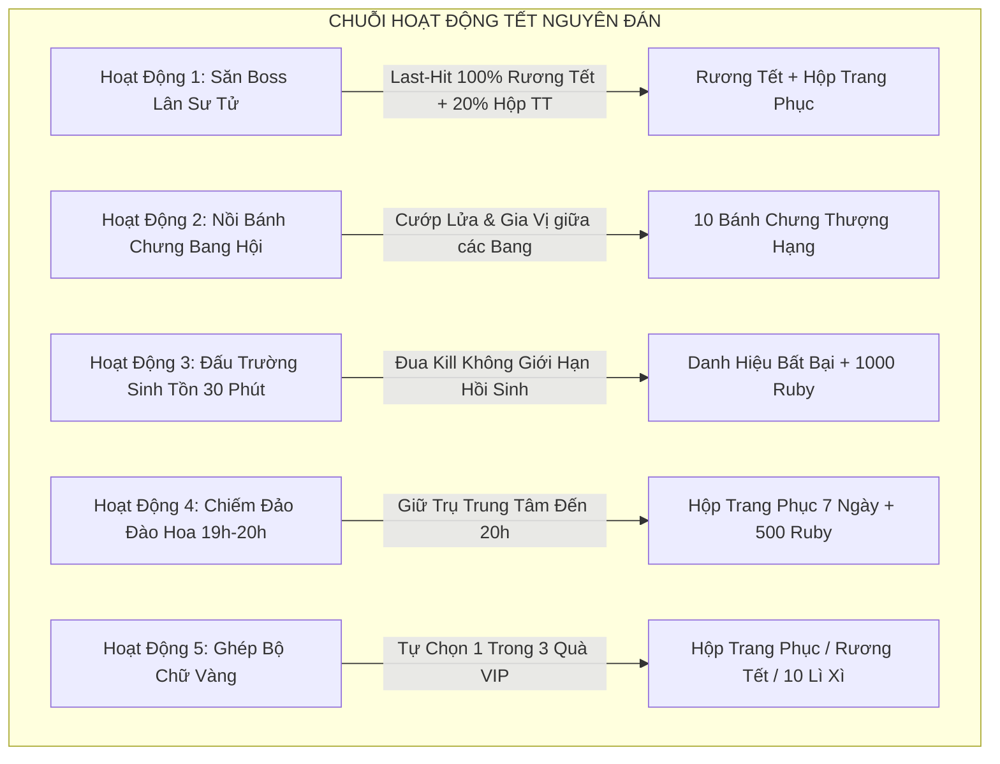
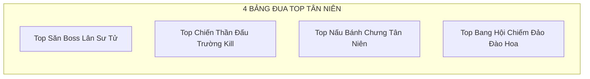

# 🧧 KẾ HOẠCH TỔNG THỂ SỰ KIỆN TẾT NGUYÊN ĐÁN - GAME HTTH
# "ĐẠI CHIẾN TÂN NIÊN: KHAI XUÂN ĐOẠT BẢO"

---

## MỤC LỤC
1. [Tổng Quan & Cốt Truyện Sự Kiện](#phần-1-tổng-quan--cốt-truyện-sự-kiện)
2. [Tra Cứu Toàn Bộ Tài Nguyên & Bảng Dữ Liệu (Database)](#phần-2-tra-cứu-toàn-bộ-tài-nguyên--bảng-dữ-liệu-database)
   - [2.1. Bảng `item4` (Vật phẩm Sự kiện & Tiêu hao)](#21-bảng-item4-vật-phẩm-sự-kiện--tiêu-hao)
   - [2.2. Bảng `item8` (Vật phẩm Bang Hội - Clan Items)](#22-bảng-item8-vật-phẩm-bang-hội---clan-items)
   - [2.3. Bảng `fashiontemplate` (Thời trang Tết Độc Quyền)](#23-bảng-fashiontemplate-thời-trang-tết-độc-quyền)
   - [2.4. Bảng `mobs` & `boss` (Quái vật & Boss Sự kiện)](#24-bảng-mobs--boss-quái-vật--boss-sự-kiện)
   - [2.5. Bảng `danhhieu` (Danh hiệu Tết)](#25-bảng-danhhieu-danh-hiệu-tết)
3. [Chuỗi Hoạt Động Sự Kiện Có Tính Cạnh Tranh Khốc Liệt](#phần-3-chuỗi-hoạt-động-sự-kiện-có-tính-cạnh-tranh-khốc-liệt)
   - [Hoạt động 1: Đại Chiến Boss Lân Sư Tử Tân Niên](#hoạt-động-1-đại-chiến-boss-lân-sư-tử-tân-niên)
   - [Hoạt động 2: Nồi Bánh Chưng Bang Hội & Chiến Dịch "Cướp Lửa Tân Niên"](#hoạt-động-2-nồi-bánh-chưng-bang-hội--chiến-dịch-cướp-lửa-tân-niên)
   - [Hoạt động 3: Đấu Trường Sinh Tồn Mùa Xuân (Battle Royale 30 Phút - Đua Kill)](#hoạt-động-3-đấu-trường-sinh-tồn-mùa-xuân-battle-royale-30-phút---đua-kill)
   - [Hoạt động 4: Đại Chiến Chiếm Đảo Đào Hoa (Guild War Lãnh Địa)](#hoạt-động-4-đại-chiến-chiếm-đảo-đào-hoa-guild-war-lãnh-địa)
   - [Hoạt động 5: Ghép Bộ Chữ Vàng "CÙNG - VUI - ĐÓN - TẾT - TÂN NIÊN"](#hoạt-động-5-ghép-bộ-chữ-vàng-cùng---vui---đón---tết---tân-niên)
4. [Hệ Thống Công Thức Chế Tạo Tại NPC RuBin](#phần-4-hệ-thống-công-thức-chế-tạo-tại-npc-rubin)
5. [Hệ Thống Đua Top & Phần Thưởng Bảng Xếp Hạng (BXH)](#phần-5-hệ-thống-đua-top--phần-thưởng-bảng-xếp-hạng-bxh)
6. [Cơ Chế Cân Bằng, Chống Gian Lận (Anti-Cheat)](#phần-6-cơ-chế-cân-bằng-chống-gian-lận-anti-cheat)
7. [Cơ Chế Bật / Tắt Sự Kiện (Event Toggle Architecture)](#phần-7-cơ-chế-bật--tắt-sự-kiện-event-toggle-architecture)

---

## PHẦN 1: TỔNG QUAN & CỐT TRUYỆN SỰ KIỆN

* **Tên Sự Kiện:** **ĐẠI CHIẾN TÂN NIÊN - KHAI XUÂN ĐOẠT BẢO**
* **Thời gian diễn ra:** 14 ngày (Từ 26 Tháng Chạp đến hết Mùng 10 Tết).
* **Bối cảnh:**
  > Một mùa xuân mới lại về trên khắp Đại Hải Trình. Vùng biển Tân Thế Giới bất ngờ xuất hiện **Đảo Đào Hoa** chứa vô số châu báu cổ đại và linh vật **Lân Sư Tử Hoàng Kim**. Các Băng Hải Tặc khắp nơi bắt đầu giương cờ xuất trận, cạnh tranh quyết liệt từ việc gom nguyên liệu nấu bánh, săn Boss Lân Sư Tử, thi đấu Đấu Trường Sinh Tồn cho đến các trận công thành chiến chiếm cứ Đảo Đào Hoa để đoạt lấy ngôi vị **Bá Chủ Tân Niên**.

---

## PHẦN 2: TRA CỨU TOÀN BỘ TÀI NGUYÊN & BẢNG DỮ LIỆU (DATABASE)

Tất cả các vật phẩm, trang phục, quái vật trong kế hoạch đều sử dụng **100% tài nguyên đã có sẵn trong cấu trúc Database (`htth.sql`)**, bảo đảm không bị lỗi hiển thị hay mất đồng bộ client.

### 2.1. Bảng `item4` (Vật phẩm Sự kiện & Tiêu hao)

| ID Item | Tên hiển thị | Bảng DB | Icon ID | Phân loại | Công dụng & Cách thức hoạt động trong Sự Kiện |
|:---:|:---|:---:|:---:|:---|:---|
| **351** | **Lá dong** | `item4` | 186 | Nguyên liệu | Đánh quái rơi, dùng gói Bánh Chưng ngày Tết |
| **352** | **Đậu xanh** | `item4` | 186 | Nguyên liệu | Đánh quái / Boss rơi, dùng làm nhân Bánh Chưng |
| **353** | **Gạo nếp** | `item4` | 186 | Nguyên liệu | Đánh quái rơi, nguyên liệu chính gói Bánh Chưng |
| **354** | **Thịt heo** | `item4` | 186 | Nguyên liệu | Đánh quái map cao / Boss rơi, làm nhân Bánh Chưng |
| **429** | **Bó lạt tre** | `item4` | 246 | Nguyên liệu | Thu thập từ nhiệm vụ Tết / Cướp Nồi Bánh |
| **430** | **Hũ gia vị** | `item4` | 246 | Nguyên liệu | Rơi từ Boss Lân Sư Tử / Hoạt động Cướp Nồi Bánh Bang |
| **350** | **Bánh chưng** | `item4` | 186 | Thành phẩm | Sử dụng: Tăng 20% Sát thương, +10% Máu cuối trong 30 phút + 10.000 EXP |
| **523** | **Lá chuối** | `item4` | 299 | Nguyên liệu | Dùng làm Bánh Giầy / Bánh Tét |
| **524** | **Bột gạo** | `item4` | 299 | Nguyên liệu | Dùng làm Bánh Giầy |
| **525** | **Bánh Giầy** | `item4` | 299 | Thành phẩm | Sử dụng: Hồi phục 100% HP/MP + Buff 15% Né tránh trong 30 phút |
| **170** | **Rương Tết** | `item4` | 87 | Rương VIP | Mở ra nhận: 500 Ruby, 10.000.000 Beri, Đá khảm cấp 5-6 |
| **239** | **Rương Tết 2018 (Tân Niên)** | `item4` | 122 | Rương VIP | Mở ra nhận: 300 Ruby, 5.000.000 Beri, Đá khảm cấp 4-5 |
| **169** | **Bao Lì Xì** | `item4` | 86 | Hộp quà Tết | Mở nhận ngẫu nhiên Beri, Ruby, Bột vàng |
| **357** | **Bao lì xì Tân Niên** | `item4` | 188 | Hộp quà Tết | Mở ra nhận: Beri, Ruby, Đá khảm cấp 3-5, Vé đổi đồ thời trang |
| **236** | **Phong bao đỏ** | `item4` | 122 | Tiền tệ Event | Điểm tích lũy sự kiện |
| **629** | **Cành Đào** | `item4` | 339 | May mắn | Trưng bày: Buff 30% EXP toàn khu vực |
| **635** | **Hoa mai** | `item4` | 119 | May mắn | Nộp tích điểm sự kiện cá nhân & bang hội |
| **630** | **Chữ Cùng** | `item4` | 340 | Mảnh ghép chữ | Ghép trọn bộ 5 chữ để đổi quà tự chọn |
| **631** | **Chữ Vui** | `item4` | 340 | Mảnh ghép chữ | Ghép trọn bộ 5 chữ để đổi quà tự chọn |
| **632** | **Chữ Đón** | `item4` | 340 | Mảnh ghép chữ | Ghép trọn bộ 5 chữ để đổi quà tự chọn |
| **633** | **Chữ Tết** | `item4` | 340 | Mảnh ghép chữ | Ghép trọn bộ 5 chữ để đổi quà tự chọn |
| **634** | **Chữ 2023 (Tân Niên)** | `item4` | 340 | Mảnh ghép chữ | Chữ siêu hiếm, rơi từ Boss Siêu Trùm, Boss Lân Sư Tử |
| **355** | **Rương nguyên liệu tết**| `item4` | 186 | Rương | Mở ra nhận ngẫu nhiên đầy đủ các loại nguyên liệu nấu bánh |
| **356** | **Hộp trang phục** | `item4` | 187 | Rương VIP | Mở ra chọn 1 trong các bộ thời trang Tết vĩnh viễn |
| **637** | **Hộp trang phục tết 1**| `item4` | 341 | Rương VIP | Nhận bộ Trang phục Tết Tân Niên |
| **638** | **Hộp trang phục tết 2**| `item4` | 342 | Rương VIP | Nhận bộ Trang phục Hổ Vằn / Thần Tài |
| **158** | **Rương đại ác quỷ** | `item4` | 112 | Rương Đua Top | Mở ra nhận Trái Ác Quỷ Thượng Cấp ngẫu nhiên |
| **218** | **Rương thần thoại** | `item4` | 172 | Rương Đua Top | Mở ra nhận Trang bị & Vật phẩm Thần Thoại quý giá |


---

### 2.2. Bảng `item8` (Vật phẩm Bang Hội - Clan Items)

| ID Item | Tên hiển thị | Bảng DB | Icon ID | Công dụng trong Sự Kiện Tết |
|:---:|:---|:---:|:---:|:---|
| **23** | **Nồi nấu bánh Tét** | `item8` | 390 | Triệu hồi Nồi Bánh Tét tại Lãnh Địa Bang, cả bang cùng góp nguyên liệu nấu và canh phòng bang địch phá |
| **22** | **Vé gọi Lân** | `item8` | 364 | Triệu hồi Boss Lân Sư Tử ngay tại Map Bang để cả bang săn quà Tết độc quyền |
| **19** | **Bất tử** | `item8` | 271 | Dùng trong Bang Chiến / Chiếm Đảo Đào Hoa (Bất tử 15 giây) |
| **20** | **Kháng tất cả** | `item8` | 272 | Bảo vệ Trụ Đảo / Nồi Bánh khỏi toàn bộ sát thương trong 15 giây |

---

### 2.3. Bảng `fashiontemplate` (Thời trang Tết Độc Quyền)

| ID Fashion | Tên Thời Trang | Icon | Bộ phận hiển thị (mwear) | Chỉ số sức mạnh (Option) | Thời hạn |
|:---:|:---|:---:|:---|:---|:---:|
| **95** | **Trang phục Thần Tài** | 91 | `[-1,959,-1,960,-1,961,-1,-1]` | +12% Né đòn, +7% Xuyên giáp, +10% Miễn thương, +10% May mắn, +30% Beri đánh quái | Vĩnh viễn |
| **78** | **Áo Dài Tết Nam** | 75 | `[-1,-1,-1,870,-1,871,-1,-1]` | +8% Xuyên giáp, +8% Chí mạng, +10% Hồi chiêu, +10% Beri | Vĩnh viễn |
| **79** | **Áo Dài Tết Nữ** | 76 | `[-1,872,-1,873,-1,874,-1,-1]` | +8% Xuyên giáp, +8% Chí mạng, +10% Hồi chiêu, +10% Beri | Vĩnh viễn |
| **105/106**| **Trang phục Hổ Vằn** | 100/101 | `[-1,984,-1,985,-1,986,-1,-2]` | +10% Chí mạng, +10% Né tránh, +10% Máu cuối | Vĩnh viễn |
| **53/54** | **Trang phục Chấn Thiên** | 52 | `[757,-1,-1,719,-1,720,729,-2]` | +12% Chí mạng, +10% Xuyên giáp, +10% Né tránh | Vĩnh viễn |
| **55** | **Thời trang Bão Tố** | 53 | `[-1,758,-1,748,-1,749,747,-2]` | +12% Miễn thương, +10% Chí mạng, +10% Né tránh | Thưởng Top 1 Bang Hội |
| **128** | **Thời trang Gol D. Roger**| 121 | `[-1,1054,-1,1053,-1,1052,1055,-2]` | +16% Né tránh, +11% Miễn thương, +16% Máu, +11% Giảm miễn thương, 5% Bất tử 5s | Thưởng Quán Quân Top 1 |

---

### 2.4. Bảng `mobs` & `boss` (Quái vật & Boss Sự kiện)

| Mob ID | Tên Boss / Quái | Bảng DB | Level | HP cơ bản | Vị trí xuất hiện (Map) | Phần thưởng khi bị tiêu diệt |
|:---:|:---|:---:|:---:|:---|:---|:---|
| **153** | **Boss Lân Sư Tử** | `mobs` / `boss` | 99 | 100,000,000 HP | Các map dã ngoại cho phép (Trừ làng, trừ 2000, 1001) | 100% Rương Tết (170), 20% Hộp Trang Phục Tết (356) |
| **135-140**| **Siêu Trùm Thế Giới** | `boss` | 45-95 | 43,000,000 HP | Khung giờ 12h, 18h, 20h, 22h | Nguyên liệu Tết x5 + Bao lì xì Tân Niên |

---

### 2.5. Bảng `danhhieu` (Danh hiệu Tết)

| ID | Tên Danh Hiệu | Thuộc tính kích hoạt | Nguồn đạt được |
|:---:|:---|:---|:---|
| **0** | **Vua Biển Cả (Tân Niên)** | +10% Sát thương, +10% Phòng thủ | Quán quân Top 1 Toàn Máy Chủ |
| **4** | **Bất Bại** | +15% Miễn thương | Top 1 Đấu Trường Sinh Tồn Tết |
| **7** | **Đại Thần** | +15% HP & MP | Top 1 Nấu Bánh Chưng |
| **8** | **Thiên Tử Tân Niên** | +15% Sát thương toàn phần | Thống lĩnh Bang Hội Top 1 Chiếm Đảo |

---

## PHẦN 3: CHUỖI HOẠT ĐỘNG SỰ KIỆN CÓ TÍNH CẠNH TRANH KHỐC LIỆT



---

### HOẠT ĐỘNG 1: ĐẠI CHIẾN BOSS LÂN SƯ TỬ TÂN NIÊN
* **Linh vật Boss:** Duy nhất **Boss Lân Sư Tử (Mob ID 153)**.
* **Lịch xuất hiện:** Cố định vào các khung giờ vàng **12:00, 18:00, 20:30, 22:30** mỗi ngày.
* **Khu vực xuất hiện (Map Spawn):**
  * Xuất hiện ngẫu nhiên tại **các map dã ngoại cho phép**.
  * **QUY TẮC LOẠI TRỪ:** **Không xuất hiện ở tất cả các Map Làng / Thành phố an toàn** (0, 2, 8, 15, 23, 31, 39, 47,...) và **KHÔNG xuất hiện ở Map 2000, Map 1001**.
  * *Danh sách map spawn tiêu chuẩn:* Map 3, 4, 7, 10, 11, 12, 13, 16, 18, 19, 20, 24, 26, 27, 28, 32, 34, 35, 36, 40, 42, 43, 44, 48, 50, 51, 52, 63, 65, 68, 70, 71, 72, 82, 84, 85, 86, 94, 95, 96, 97, 98, 99, 100, 101, 112, 115, 116, 117, 118, 124, 125, 126, 192, 193, 194, 195, 196, 197.
* **Cơ chế Cạnh Tranh (Last Hit):**
  * **Đòn Kết Liễu (Last Hit):** Người chơi tung đòn đánh cuối cùng tiêu diệt Boss nhận phần thưởng:
    * **100% nhận:** **1 Rương Tết (170)**.
    * **20% tỷ lệ nhận:** **1 Hộp Trang Phục Tết (356)**.

---

### HOẠT ĐỘNG 2: NỒI BÁNH CHƯNG BANG HỘI & CHIẾN DỊCH "CƯỚP LỬA TÂN NIÊN"
* **Địa điểm:** Lãnh Địa Bang Hội / Bản đồ trung tâm.
* **Cơ chế Nấu Bánh:**
  * Bang chủ hoặc Phó bang sử dụng **Nồi nấu bánh Tét (item8 ID 23)** để dựng Nồi Bánh Bang.
  * Các thành viên cùng gom góp **Lá dong (351), Đậu xanh (352), Gạo nếp (353), Thịt heo (354)** bỏ vào nồi.
  * Nồi bánh cần thời gian đun liên tục **60 phút** và cần thành viên túc trực canh giữ.
* **Cơ chế Cạnh Tranh & Đột Kích giữa các Bang:**
  * Các bang hội đối thủ có thể kéo quân sang xâm nhập Lãnh Địa để **"Cướp Lửa"** hoặc tấn công Nồi Bánh.
  * Nếu nồi bánh bị phá hủy: Bang bị phá mất 50% nguyên liệu; bang tấn công cướp được số nguyên liệu đó quy đổi thành **Hũ Gia Vị (430)** và điểm cống hiến bang.
  * Nếu bảo vệ thành công sau 60 phút: Mỗi thành viên nhận **10 Bánh Chưng Thượng Hạng (350)**.

---

### HOẠT ĐỘNG 3: ĐẤU TRƯỜNG SINH TỒN MÙA XUÂN (BATTLE ROYALE 120 PHÚT - ĐUA KILL)
* **Thời gian mở:** Mở vào Thứ 7 và Chủ Nhật hàng tuần:
  * **Thời gian:** **19:00 - 21:00** (kéo dài đúng 120 phút / 2 tiếng).
* **Luật thi đấu & Cách tính điểm:**
  * Giới hạn tối đa **30 người chơi** mỗi lượt đấu, toàn bộ vào chung một bản đồ sinh tồn PK tự do.
  * **Cơ chế Hồi Sinh:** Người chơi trong map này **KHÔNG GIỚI HẠN LƯỢT HỒI SINH**. Khi bị hạ gục, nhân vật sẽ lập tức hồi sinh tại điểm xuất phát/an toàn của bản đồ để tiếp tục giao tranh giành điểm hạ gục (Kill) mà không bị loại khỏi trận đấu.
  * **Quy tắc Xếp Hạng:** Sau đúng **120 phút thi đấu**, hệ thống tự động chốt kết quả: **Ai có số Kill hạ gục đối thủ nhiều nhất sẽ đoạt TOP 1**, tương tự cho các thứ hạng tiếp theo (Top 2, Top 3, Top 4-10). Nếu bằng Kill, người đạt số Kill đó trước sẽ xếp trên.
* **Phần thưởng Đấu Trường:**
  * **Ngày thường:**
    * **Top 1:** **Danh hiệu "Bất Bại" [7 Ngày] + 1.000 Ruby**.
    * **Top 2 - 3:** 500 Ruby.
    * **Top 4 - 10:** 200 Ruby.
  * **Ngày Tết (Event Tet mở):**
    * **Top 1:** **Danh hiệu "Bất Bại" [7 Ngày] + 1.000 Ruby + 1 Hộp Thời Trang Tết Vĩnh Viễn (356)**.
    * **Top 2 - 3:** 500 Ruby + 1 Hộp Trang Phục Tết 1 (637) [30 Ngày] + 10 Bao Lì Xì Tân Niên (357).
    * **Top 4 - 10:** 200 Ruby + 5 Bao Lì Xì Tân Niên (357).

* **Thiết lập Bản đồ Đấu Trường (Map ID: 2026 - Clone từ Map ID 2):**
  * **Cấu hình Map:** Lấy toàn bộ dữ liệu địa hình, tile và MapBack từ **Map ID 2** (1-1 Rừng Làng), thiết lập số lượng tối đa **30 người chơi/khu**, loại bỏ quái vật thường (`mobs = '[]'`).
  * **NPC trong Map:**
    * **NPC Bảng Xếp Hạng Top Kill (ID: 120):** Đặt tại tọa độ `(x: 450, y: 173)` để người chơi trực tiếp tra cứu BXH số mạng hạ gục trong trận.
    * **NPC Trọng Tài (ID: -202):** Đặt tại tọa độ `(x: 250, y: 173)` để hỗ trợ rời khỏi sàn đấu về Làng.
    * **NPC Chuyển Khu (ID: -7):** Đặt tại tọa độ `(x: 122, y: 173)`.

* **Lệnh SQL Khởi Tạo Map Đấu Trường (Chạy trực tiếp vào Database):**
```sql
-- LỆNH TẠO MAP ĐẤU TRƯỜNG SINH TỒN MÙA XUÂN (CLONE DATA TỪ MAP ID 2)
INSERT INTO `maps` (`id`, `name`, `mobs`, `maxzone`, `maxplayer`, `npcs`, `boat`, `typeViewPlayer`, `b`, `specMap`, `vgos`, `data`, `MapBack`, `id_eff_map`, `level`, `typeChangeMap`, `mPosMapTrain`, `strTimeChange`)
SELECT 
    2026 AS `id`,
    'Đấu Trường Mùa Xuân' AS `name`,
    '[]' AS `mobs`,
    5 AS `maxzone`,
    30 AS `maxplayer`,
    '[[120, "Bảng Xếp Hạng", "Top Kill", "Xem danh sách các cao thủ đang dẫn đầu số mạng hạ gục tại Đấu Trường Mùa Xuân.", 450, 173, 1, 0, 0, 0, 0, [63, 1], 0, 0, []], [-202, "Trọng Tài", "Rời Đấu Trường", "Bạn có muốn rời khỏi Đấu Trường Mùa Xuân để trở về Làng?", 250, 173, 1, 0, 0, 0, 0, [71, 2], 0, 0, []], [-7, " ", "Chuyển khu", "", 122, 173, 99, -1, 24, 24, 0, [5, 1], 0, 0, []]]' AS `npcs`,
    `boat`,
    0 AS `typeViewPlayer`,
    `b`,
    0 AS `specMap`,
    '[]' AS `vgos`,
    `data`,
    `MapBack`,
    `id_eff_map`,
    `level`,
    `typeChangeMap`,
    `mPosMapTrain`,
    `strTimeChange`
FROM `maps` 
WHERE `id` = 2
ON DUPLICATE KEY UPDATE `name`=VALUES(`name`), `npcs`=VALUES(`npcs`), `mobs`=VALUES(`mobs`), `maxplayer`=VALUES(`maxplayer`), `maxzone`=VALUES(`maxzone`);
```
> **Lưu ý triển khai Server:** Đã khởi tạo file tài nguyên `data/map/2026` từ `data/map/2` trên server để load đầy đủ tile map.

---

### HOẠT ĐỘNG 4: ĐẠI CHIẾN CHIẾM ĐẢO ĐÀO HOA (GUILD WAR LÃNH ĐỊA)
* **Thời gian:** Tối Thứ 3, Thứ 5, Chủ Nhật từ **19:00 - 20:00**.
* **Quy mô:** Cuộc chiến tranh giành cứ điểm giữa toàn bộ Bang Hội trong server.
* **Cơ chế:**
  * Bản đồ Đảo Đào Hoa mở ra gồm **3 Trụ Phục Sinh & 1 Trụ Long Mạch Trung Tâm**.
  * Các bang hội phải giao tranh PK tự do, cướp cờ và giữ trụ.
  * Bang nào duy trì quyền kiểm soát Trụ Trung Tâm liên tục cho đến **20:00** sẽ trở thành **Chủ Đảo Đào Hoa** trong 48 giờ.
* **Đặc quyền Bang Chiến Thắng:**
  * Mỗi thành viên nhận **1 Hộp Trang Phục Tết (356) [7 Ngày] + 500 Ruby**.

* **Thiết lập Bản đồ Đảo Đào Hoa (Map ID: 2027 - Clone từ Map ID 8):**
  * **Cấu hình Map:** Lấy toàn bộ dữ liệu địa hình, tile và MapBack từ **Map ID 8** (Đảo Vỏ Sò), thiết lập số lượng tối đa **100 người chơi/khu** để phục vụ Guild War quy mô lớn, không có quái thường (`mobs = '[]'`).
  * **NPC & Trụ trong Map:**
    * **NPC Trụ Long Mạch (ID: 120):** Đặt tại tọa độ `(x: 600, y: 210)` - vị trí trung tâm để các bang hội tranh chấp và chiếm giữ.
    * **NPC Trọng Tài (ID: -202):** Đặt tại tọa độ `(x: 200, y: 210)` để người chơi đối thoại rời khỏi Đảo Đào Hoa về Làng.
    * **NPC Chuyển Khu (ID: -7):** Đặt tại tọa độ `(x: 120, y: 210)`.

* **Lệnh SQL Khởi Tạo Map Đảo Đào Hoa (Chạy trực tiếp vào Database):**
```sql
-- LỆNH TẠO MAP ĐẢO ĐÀO HOA (CLONE DATA TỪ MAP ID 8)
INSERT INTO `maps` (`id`, `name`, `mobs`, `maxzone`, `maxplayer`, `npcs`, `boat`, `typeViewPlayer`, `b`, `specMap`, `vgos`, `data`, `MapBack`, `id_eff_map`, `level`, `typeChangeMap`, `mPosMapTrain`, `strTimeChange`)
SELECT 
    2027 AS `id`,
    'Đảo Đào Hoa' AS `name`,
    '[]' AS `mobs`,
    2 AS `maxzone`,
    100 AS `maxplayer`,
    '[[120, "Trụ Long Mạch", "Chiếm Đóng", "Trụ Long Mạch Đảo Đào Hoa - Bang hội đứng gần để chiếm giữ!", 600, 210, 1, 0, 0, 0, 0, [63, 1], 0, 0, []], [-202, "Trọng Tài", "Rời Đảo", "Bạn có muốn rời khỏi Đảo Đào Hoa để trở về Làng?", 200, 210, 1, 0, 0, 0, 0, [71, 2], 0, 0, []], [-7, " ", "Chuyển khu", "", 120, 210, 99, -1, 24, 24, 0, [5, 1], 0, 0, []]]' AS `npcs`,
    `boat`,
    0 AS `typeViewPlayer`,
    `b`,
    0 AS `specMap`,
    '[]' AS `vgos`,
    `data`,
    `MapBack`,
    `id_eff_map`,
    `level`,
    `typeChangeMap`,
    `mPosMapTrain`,
    `strTimeChange`
FROM `maps` 
WHERE `id` = 8
ON DUPLICATE KEY UPDATE `name`=VALUES(`name`), `npcs`=VALUES(`npcs`), `mobs`=VALUES(`mobs`), `maxplayer`=VALUES(`maxplayer`), `maxzone`=VALUES(`maxzone`);
```
> **Lưu ý triển khai Server:** Đã khởi tạo sẵn file tài nguyên `data/map/2027` từ `data/map/8` trên server để load đầy đủ tile map.

---

### HOẠT ĐỘNG 5: GHÉP BỘ CHỮ VÀNG "CÙNG - VUI - ĐÓN - TẾT - TÂN NIÊN"
* **Thu thập 5 mảnh chữ vàng thông qua các hoạt động:**
  * **Chữ Cùng (630):** Đánh quái thường map 1 - 50.
  * **Chữ Vui (631):** Đánh quái thường map 51 - 100.
  * **Chữ Đón (632):** Tham gia Phó bản & Đấu trường.
  * **Chữ Tết (633):** Đánh quái map cao & tham gia hoạt động Bang.
  * **Chữ 2023 / Tân Niên (634):** Săn Boss Lân Sư Tử & Boss Thế Giới.
* **Đổi thưởng tại NPC RuBin:** Khi gom đủ trọn bộ 5 chữ vàng, người chơi được **TỰ CHỌN 1 TRONG 3 PHẦN QUÀ**:
  * 🎁 **Lựa chọn 1:** **1 Hộp Trang Phục Tết (item4 ID: 356)** *(Mở ra chọn trang phục Tết vĩnh viễn)*.
  * 🎁 **Lựa chọn 2:** **1 Rương Tết (item4 ID: 170)** *(Mở ra nhận 500 Ruby, 10.000.000 Beri, Đá khảm cấp cao)*.
  * 🎁 **Lựa chọn 3:** **10 Bao Lì Xì Tân Niên (item4 ID: 357)** *(Mở ra nhiều tài nguyên may mắn ngày Tết)*.

---

## PHẦN 4: HỆ THỐNG CÔNG THỨC CHẾ TẠO TẠI NPC RUBIN

```
[Công Thức 1: Bánh Chưng Ngày Tết (350)]
* Nguyên liệu: Lá Dong (351) x5 + Gạo Nếp (353) x5 + Đậu Xanh (352) x5 + Thịt Heo (354) x5 + 50.000 Beri
=> Nhận ngay: 1 Bánh Chưng (item4 ID: 350) + 10.000 EXP + 1 Điểm Nấu Bánh (Đua Top)
   * Tác dụng khi sử dụng Bánh Chưng: Tăng 20% Sát thương + 10% Máu tối đa trong 30 phút.

[Công Thức 2: Bánh Giầy Thần Tài (525)]
* Nguyên liệu: Lá Chuối (523) x5 + Bột Gạo (524) x5 + Bó Lạt Tre (429) x2 + 30.000 Beri
=> Nhận ngay: 1 Bánh Giầy (item4 ID: 525) + 5.000 EXP
   * Tác dụng khi sử dụng Bánh Giầy: Hồi phục 100% HP/MP tức thời + Buff 15% Né tránh trong 30 phút.

[Công Thức 3: Đổi Bộ Chữ Vàng Tân Niên]
* Nguyên liệu: [Chữ Cùng (630)] + [Chữ Vui (631)] + [Chữ Đón (632)] + [Chữ Tết (633)] + [Chữ 2023 (634)]
=> Tự chọn nhận 1 trong 3 phần quà sau:
   - Lựa chọn 1: 1 Hộp Trang Phục Tết (item4 ID: 356)
   - Lựa chọn 2: 1 Rương Tết (item4 ID: 170)
   - Lựa chọn 3: 10 Bao Lì Xì Tân Niên (item4 ID: 357)
```

---

## PHẦN 5: HỆ THỐNG ĐUA TOP & PHẦN THƯỞNG BẢNG XẾP HẠNG (BXH)



### 🏆 5.1. Bảng 1: Top Săn Boss & Tiêu Diệt Lân Sư Tử (Type 14)
* **Top 1:** **Thời Trang Gol D. Roger (Vĩnh Viễn)** + **Danh hiệu "Vua Biển Cả"** + **1 Rương Đại Ác Quỷ (158)** + **5.000 Ruby**.
* **Top 2 - 3:** Thời Trang Gol D. Roger (30 Ngày) + 1 Rương Thần Thoại (218) + 3.000 Ruby.
* **Top 4 - 10:** Hộp Trang Phục Tết (356) + 1.000 Ruby + 50 Bao Lì Xì Tân Niên (357).

### ⚔️ 5.2. Bảng 2: Top Chiến Thần Đấu Trường Kill (Type 15)
* **Top 1:** **Danh hiệu "Bất Bại"** + **Thời Trang Chấn Thiên (Vĩnh Viễn)** + **10 Viên Đá Thần Thoại (647)** + **3.000 Ruby**.
* **Top 2 - 3:** Thời Trang Chấn Thiên (30 Ngày) + 5 Viên Đá Thần Thoại (647) + 2.000 Ruby.
* **Top 4 - 10:** Hộp Trang Phục Tết 2 (638) + 1.000 Ruby.

### 🍲 5.3. Bảng 3: Top Nấu Bánh Chưng Tân Niên (Type 16)
* **Top 1:** **Trang Phục Thần Tài (Vĩnh Viễn)** + **Danh hiệu "Đại Thần"** + **1 Rương Tết (170)** + **1 Rương Thần Thoại (218)** + **3.000 Ruby**.
* **Top 2 - 3:** Trang Phục Thần Tài (30 Ngày) + 1 Rương Tết 2018 (239) + 1.500 Ruby.
* **Top 4 - 10:** 1 Rương Tết 2018 (239) + 1.000 Ruby.

### 🏴‍☠️ 5.4. Bảng 4: Top Bang Hội Hùng Mạnh (Type 18)
* **Bang Hội Top 1:**
  * Chủ Bang nhận: **Thời Trang Bão Tố (ID 55) [Vĩnh Viễn]** + **Danh hiệu "Thiên Tử Tân Niên"** + **1 Rương Đại Ác Quỷ (158)**.
  * Tất cả thành viên trong bang nhận: **500 Ruby + 50 Bao Lì Xì Tân Niên (357) + 20 Bánh Chưng Thượng Hạng (350)**.
* **Bang Hội Top 2 - 3:**
  * Mỗi thành viên nhận: 300 Ruby + 30 Bao Lì Xì Tân Niên (357).

---

## PHẦN 6: CƠ CHẾ CÂN BẰNG, CHỐNG GIAN LẬN (ANTI-CHEAT)

1. **Giới hạn Cấp độ rơi đồ (Level Gap Check):** Quái vật chỉ rơi nguyên liệu Tết khi chênh lệch cấp độ với người chơi không quá **±5 Level** (ngăn clone cấp cao về map tân thủ farm).
2. **Rate Limit Mở Bao Lì Xì & Đổi Quà:** Áp dụng thời gian trễ tối thiểu **1000ms** giữa các lượt mở/đổi để ngăn chặn việc spam tool hoặc auto click.
3. **Giới hạn số lần Cướp Nồi Bánh:** Mỗi người chơi chỉ được hưởng thưởng cướp nồi bánh tối đa **10 lần/ngày** để triệt tiêu tình trạng bơm điểm chéo (farm point).

---

## PHẦN 7: CƠ CHẾ BẬT / TẮT SỰ KIỆN (EVENT TOGGLE ARCHITECTURE)

Sự kiện Tết được tích hợp cơ chế đóng/mở linh hoạt chuẩn mô hình `EventTrungThu` hiện có trong mã nguồn game, giúp Admin/GM quản trị sự kiện theo thời gian thực mà không cần restart server.

### 7.1. Cấu Trúc Biến Cờ & Hàm Kiểm Tra (Static Flag & Methods)
* **Khai báo trong `EventTet.java`:**
```java
public static boolean IS_OPEN = false; // Biến cờ bật/tắt sự kiện Tết
private static final String CONFIG_KEY = "event-tet";

public static boolean isEvent() {
    return IS_OPEN;
}

public static void setEvent(boolean open) {
    IS_OPEN = open;
    if (open) {
        getInstance().scheduleNextBossSpawn();
        broadcastMessage("🧧 Sự kiện Tết Nguyên Đán: Khai Xuân Đoạt Bảo đã chính thức bắt đầu!");
    } else {
        broadcastMessage("🧧 Sự kiện Tết Nguyên Đán đã kết thúc. Hẹn gặp lại vào mùa lễ hội sau!");
    }
}
```

### 7.2. Cấu Hình Tự Động Qua File Cấu Hình (`htth.conf`)
* **Khóa cấu hình trong `htth.conf`:**
```properties
# Cấu hình bật/tắt Sự kiện Tết (true = Bật, false = Tắt)
event-tet: true
```
* Khi server khởi động (`Manager.java`), hàm `EventTet.loadConfig(config)` sẽ tự động đọc giá trị này để kích hoạt luồng sự kiện.

### 7.3. Bộ Lệnh Chat Dành Riêng Cho Quản Trị Viên (GM Admin Commands)
Admin có thể gõ trực tiếp các lệnh sau vào khung chat trong game:

| Lệnh Chat GM | Quyền hạn | Tác dụng |
|:---|:---:|:---|
| `@event-tet-on` | Admin / GM | **Bật sự kiện Tết** ngay lập tức trên toàn server (không cần restart server). |
| `@event-tet-off` | Admin / GM | **Tắt sự kiện Tết** ngay lập tức (ngừng rơi nguyên liệu, đóng menu đổi thưởng). |
| `@event-tet-status` | Admin / GM | Xem trạng thái sự kiện: Bật/Tắt, thời gian ca Boss Lân tiếp theo, số người trong Đấu Trường. |
| `@event-tet-boss` | Admin / GM | Triệu hồi khẩn cấp **Boss Lân Sư Tử (Mob ID 153)** ngay tại vị trí GM đứng để test cơ chế Last-Hit & phần thưởng. |
| `@event-tet-arena` | Admin / GM | Mở cổng cưỡng chế **Đấu Trường Mùa Xuân (Map 2026)** ngay lập tức để kiểm tra đua Kill. |

### 7.4. Tác Động Logic Khi TẮT Sự Kiện (`EventTet.isEvent() == false`)
1. **Đánh quái dã ngoại:** Quái vật thường trên toàn bản đồ lập tức **ngừng rơi nguyên liệu Tết** (Lá dong, Đậu xanh, Gạo nếp, Thịt heo, Mảnh chữ vàng).
2. **NPC RuBin:** Khi đối thoại với NPC RuBin, các menu làm Bánh Chưng, Bánh Giầy và Đổi bộ 5 chữ sẽ đóng lại và thông báo: *"Sự kiện Tết hiện chưa mở hoặc đã kết thúc!"*.
3. **Boss & Đấu Trường:** Tự động dừng luồng hẹn giờ spawn Boss Lân Sư Tử và đóng cửa dịch chuyển vào Map Đấu Trường Sinh Tồn (2026) & Đảo Đào Hoa (2027).

---
*Tài liệu được lưu trữ tại file: [TET_EVENT_PLAN.md](file:///d:/project/GameHTTH/TET_EVENT_PLAN.md)*
