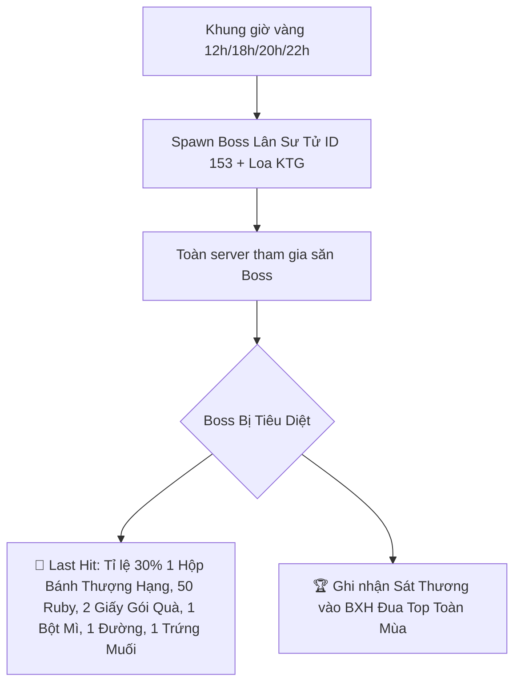

# 🌕 Kế Hoạch Thiết Kế Sự Kiện Trung Thu: "Đêm Rằm Hải Tặc"
*(100% Sử Dụng Item4 & Tài Nguyên Sẵn Có Trong Database `full_db_htth` - Tích Hợp Cơ Chế Bật/Tắt Độc Lập)*

> 🎯 **Mục tiêu:** 
> 1. Thiết kế sự kiện Trung Thu hoàn chỉnh chỉ sử dụng các vật phẩm **Item4**, mob Boss, thời trang đã tồn tại trong database gốc.
> 2. Phân bổ nguồn thu thập nguyên liệu qua 4 hoạt động chính: **Đánh quái trên dưới 10 cấp**, **Làm Nhiệm vụ lặp**, **Làm Nhiệm vụ băng**, và **Đi Phó bản Nami liên tầng**.
> 3. Xây dựng module **`event.EventTrungThu`** khép kín với cờ Bật/Tắt (**Toggle ON/OFF**) qua file config `htth.conf` hoặc lệnh GM realtime, tuyệt đối không ảnh hưởng đến bất kỳ code logic gốc nào của server.

---

## 🎯 1. Tổng Quan Sự Kiện & Tài Nguyên Database Gốc

| Hạng Mục | Thông Tin & ID Database Gốc |
| :--- | :--- |
| **Tên sự kiện** | **Vui Hội Trung Thu – Đêm Rằm Hải Tặc** |
| **Boss Sự Kiện** | 🦁 **Lân Sư Tử (Mob ID `153`)** có sẵn trong bảng `mobs` |
| **NPC Sự Kiện** | NPC Trung Thu / Trưởng Làng tại các Làng Khởi Đầu (Windmill, Foosha, Shells) |
| **Thời Trang Thưởng**| 👘 **Thời trang Chú Cuội (Fashion ID `65`)** & **Chị Hằng (Fashion ID `66`)** *(+130% né tránh, +80% HP, +100% Miễn thương - Vĩnh viễn)* |
| **Cơ Chế Bật/Tắt** | Cấu hình qua `htth.conf` (`event-trung-thu: true/false`) + Lệnh Admin ingame |

---

## 📦 2. Danh Mục Vật Phẩm Sử Dụng Trong Sự Kiện (100% Thuộc `item4` Có Sẵn)

### 🌾 A. Nguyên Liệu Sự Kiện (`item4`) & Nguồn Thu Thập (1 Hoạt Động = 1 Item)

| ID Item4 | Tên Nguyên Liệu | Icon | Mô Tả Trong DB | Hoạt Động Thu Thập Độc Quyền (1-1) |
| :---: | :--- | :---: | :--- | :--- |
| **`202`** | **Bột Mì** | `156` | Nguyên liệu làm bánh Trung Thu | ⚔️ **Đánh quái thường** trên dưới 10 cấp ($\pm 10$ Level) - Tối đa 100 cái/ngày |
| **`200`** | **Đường** | `154` | Nguyên liệu làm bánh Trung Thu | 📜 **Làm Nhiệm Vụ Lặp** (Hằng ngày) - Nhận 1 cái/nhiệm vụ, Tối đa 100 cái/ngày |
| **`203`** | **Trứng Muối** | `157` | Nguyên liệu làm bánh Trung Thu | 🏴‍☠️ **Nhiệm Vụ Băng** (2 cái/lần) & ⚔️ **PvP / Truy Nã** (5 cái/lần thắng, tối đa 100 cái/ngày) |
| **`473`** | **Đèn ông sao** | `421` | Lồng đèn trung thu | 🏰 **Phó Bản Nami Liên Tầng** (1 cái/tầng) & 🦶 **Đá đít Mr.3** (1 cái/lần tiêu diệt Boss 81) |
| **`575`** | **Giấy gói quà** | `104` | Dùng để gói thành Hộp bánh thượng hạng | 🦁 **Săn Boss Lân (Mob 153)** & 🛡️ **Vận buôn** (1 cái/chuyến thành công) |


---

### 🥮 B. Thành Phẩm Sự Kiện (`item4`)

| ID Item4 | Tên Thành Phẩm | Icon | Phân Loại | Phần Thưởng Khi Sử Dụng (Nhận 1 Trong Các Quà Ngẫu Nhiên) |
| :---: | :--- | :---: | :---: | :--- |
| **`207`** | **Bánh Trung Thu** | `164` | Quà Ngẫu Nhiên | 🎁 **Mở nhận 1 trong các phần quà:**<br>• 💎 **1 Đá Khảm (Cấp 1-6) ngẫu nhiên**<br>• 💰 50.000 - 150.000 Beri<br>• 🌟 50 - 150 Ruby<br>• 🌾 50 Bột Cường Hóa / 500 Đá Ngũ Sắc |
| **`208`** | **Bánh Đậu Xanh** | `161` | Quà Ngẫu Nhiên | 🎁 **Mở nhận 1 trong các phần quà:**<br>• 💎 **1 Đá Khảm (Cấp 1-6) ngẫu nhiên**<br>• 💰 500.000 - 15.000.000 Beri<br>• 🌟 500 - 1500 Ruby |
| **`209`** | **Bánh Trứng Muối**| `162` | Quà Ngẫu Nhiên | 🎁 **Mở nhận 1 trong các phần quà:**<br>• 💎 **1 Đá Khảm (Cấp 1-6) ngẫu nhiên**<br>• 💰 800.000 - 20.000.000 Beri<br>• 🌟 100 - 200 Ruby<br>• ✨ 2-5 Tinh Thể Đá Ác Quỷ |
| **`210`** | **Bánh Hạt Sen** | `362` | Quà Ngẫu Nhiên | 🎁 **Mở nhận 1 trong các phần quà:**<br>• 💎 **1 Đá Khảm (Cấp 1-6) ngẫu nhiên**<br>• 💰 1.000.000 - 25.000.000 Beri<br>• 🌟 100 - 250 Ruby<br>• 🍯 2-5 Bột Vàng / Mai Rùa |
| **`410`** | **Đèn kéo quân** | `361` | Hiệu Ứng | 🌟 **Bắn pháo hoa rực rỡ** + Nhận ngẫu nhiên: Rương cam theo cấp độ, Mai rùa, Xp chiêu thức, Đá ác quỷ, Rương đại ác quỷ |
| **`211`** | **Hộp Bánh Trung Thu**| `165` | Mở Quà | 🎁 **Mở nhận:** 1.500-3.500 Ruby, Bột Vàng, Tinh Thể Đá Ác Quỷ, Beri |
| **`576`** | **Hộp bánh thượng hạng**| `165` | Rương VIP | 🏆 **Mở nhận Quà VIP:** 1.500-3.500, 10-20 Đá Ác Quỷ, Bột Vàng, Tinh Thể, **Thẻ TT Trung Thu (475)**, Rương Đại Ác Quỷ (ID 87),Pet thỏ (theo giờ hoặc vĩnh viễn id 34 trong bảng pet_template, Tỷ lệ 70% Pet Thỏ 1 ngày, 25% Pet Thỏ 7 ngày,5% Pet Thỏ vĩnh viễn) |
| **`475`** | **Thẻ TT Trung Thu**| `423` | Thời Trang | 👑 **Sử dụng:** Nhận trực tiếp Thời trang Chú Cuội (ID 65) hoặc Chị Hằng (ID 66) Vĩnh Viễn |


---

## 🥣 3. Công Thức Chế Tạo Sự Kiện (`activities/Join_Item.java`)

```text
[5 Bột Mì (202)]    + [3 Đường (200)]                  + 500.000 Beri                         ───► 🥮 Bánh Trung Thu (207)
[5 Bột Mì (202)]    + [3 Đường (200)] + [1 Trứng Muối] + 1.000.000 Beri                       ───► 🥮 Bánh Đậu Xanh (208)
[5 Bột Mì (202)]    + [3 Đường (200)] + [2 Trứng Muối] + 15.000.000 Beri                      ───► 🥮 Bánh Trứng Muối (209)
[5 Bột Mì (202)]    + [3 Đường (200)] + [3 Trứng Muối] + 2.000.000 Beri                       ───► 🥮 Bánh Hạt Sen (210)
[3 Đèn Ông Sao (473)] + 2.000.000 Beri                                                        ───► 🏮 Đèn Kéo Quân (410)
[1 Bánh Trung Thu]  + [1 Bánh Đậu Xanh] + [1 Bánh Trứng Muối] + [1 Bánh Hạt Sen] + 2.000.000 Beri + 50 Ruby  ───► 🎁 Hộp Bánh Trung Thu (211)
[1 Hộp Bánh (211)]  + [1 Giấy Gói Quà (575)] + 2.000.000 Beri + 100 Ruby                      ───► 🏆 Hộp Bánh Thượng Hạng (576)
```

| Thành Phẩm | Nguyên Liệu Yêu Cầu (`item4`) | Chi Phí Phụ | Tỷ Lệ Ghép |
| :--- | :--- | :---: | :---: |
| **Bánh Trung Thu (207)** | `5 Bột Mì (202)` + `3 Đường (200)` | 500.000 Beri | 100% |
| **Bánh Đậu Xanh (208)** | `5 Bột Mì (202)` + `3 Đường (200)` + `1 Trứng Muối (203)` | 1.000.000 Beri | 100% |
| **Bánh Trứng Muối (209)**| `5 Bột Mì (202)` + `3 Đường (200)` + `2 Trứng Muối (203)` | 15.000.000 Beri | 100% |
| **Bánh Hạt Sen (210)** | `5 Bột Mì (202)` + `3 Đường (200)` + `3 Trứng Muối (203)` | 2.000.000 Beri | 100% |
| **Đèn Kéo Quân (410)** | `3 Đèn Ông Sao (473)` | 2.000.000 Beri | 100% |
| **Hộp Bánh Trung Thu (211)**| `1 Bánh Trung Thu` + `1 Bánh Đậu Xanh` + `1 Bánh Trứng Muối` + `1 Bánh Hạt Sen` | 2.000.000 Beri + 50 Ruby | 100% |
| **Hộp Bánh Thượng Hạng (576)**| `1 Hộp Bánh (211)` + `1 Giấy Gói Quà (575)` | 2.000.000 Beri + 100 Ruby | 100% |


---

## 🦁 4. Cơ Chế Săn Boss Lân (Lân Sư Tử - Mob ID `153`)

### ⏰ A. Xuất Hiện & Địa Điểm
- **Khung giờ hoạt động:** Từ **11:00 đến 13:00** và từ **20:00 đến 21:00** hằng ngày.
- **Cơ chế hồi sinh:** Trong khung giờ hoạt động, sau khi Boss bị tiêu diệt (hoặc biến mất), **10 phút sau** sẽ tự động xuất hiện lại ở một map ngẫu nhiên.
- **Vị trí xuất hiện:** Ngẫu nhiên tại một trong các bản đồ (ngoại trừ các map làng).
- **Loa KTG thông báo:** Tự động thông báo kênh thế giới ngay khi Boss xuất hiện.



### 🎁 B. Chi Tiết Phần Thưởng Boss Lân:
1. **Đòn Kết Liễu (Last Hit):**
   - Tỉ lệ 30% rớt `1 Hộp Bánh Thượng Hạng (ID 576)`.
   - `50 Ruby` + `2 Giấy Gói Quà (ID 575)`.
   - `1 Bột Mì (202)` + `1 Đường (200)` + `1 Trứng Muối (203)`.
   - Loa KTG vinh danh.
2. **Thưởng Tham Gia (Gây >= 1% HP):**
   - Đã loại bỏ.
3. **Quà Nhặt Lộc Rơi Tự Do (Dưới đất):**
   - Đã loại bỏ.
4. **Bảng Xếp Hạng Top Sát Thương (Trao Sau Khi Kết Thúc Sự Kiện):**
   - Hệ thống tự động tích lũy điểm sát thương qua tất cả các trận. Phần thưởng cuối sự kiện sẽ được tùy chỉnh sau.

> [!WARNING]
> **User Review Required:**
> 1. Hiện tại code sự kiện Boss Lân trong game đang thiếu liên kết với hệ thống sát thương chung. Cần điều chỉnh `Map.java` để Boss Lân nhận 1 sát thương mỗi cú đánh và hiển thị quà khi tiêu diệt.
> 2. Vận buôn thành công chưa có code trả Giấy Gói Quà. Đề xuất: Rớt **1 Giấy Gói Quà** mỗi chuyến Vận Buôn hoàn thành. Anh đồng ý số lượng này không?

## Proposed Changes

### `Map.java`
- Thêm logic bắt ID `EventTrungThu.MOB_BOSS_LAN` tại bước tính tổng sát thương (`dame_to_target`), gán bằng 1 và gọi `onBossDamaged(p, 1)`.
- Thêm logic kiểm tra quái chết (`mob_target.hp <= 0`) để gọi `onBossKilled(p)` nếu đó là Boss Lân.

### `MenuController.java`
- Thêm code phát `Giấy Gói Quà` khi người chơi trả hàng thành công trong chức năng Vận Buôn (`case 1:` thuộc menu Lái buôn).

---

## 🔌 5. Cơ Chế Bật / Tắt Sự Kiện Độc Lập (Zero Side-Effects Architecture)

Toàn bộ sự kiện được đóng gói trong class module độc lập: **`event.EventTrungThu`**.

```text
htth_project/src/main/java/
├── event/
│   └── EventTrungThu.java        ───► Module độc lập (chứa logic spawn Boss, drop quà hoạt động, menu, use item)
├── core/
│   ├── Manager.java              ───► Đọc 'event-trung-thu: true/false' từ htth.conf
│   ├── ServerEventManager.java   ───► Hook gọi EventTrungThu.update() nếu isEvent() == true
│   └── MenuController.java       ───► Hook menu NPC nếu isEvent() == true
├── map/
│   └── Map.java                  ───► Hook rơi Bột Mì (202) khi diệt quái ±10 level
├── client/
│   ├── Quest.java / Player.java  ───► Hook thưởng Đường (200) khi hoàn thành Nhiệm vụ lặp
│   ├── Clan.java                 ───► Hook thưởng Trứng Muối (203) khi hoàn thành Nhiệm vụ băng
│   └── UseItem.java              ───► Hook xử lý Item 207-210 (Đá Khảm 6 & Quà), 211, 410, 576, 475 nếu isEvent() == true
└── activities/
    └── NamieTreasureDefense.java ───► Hook rơi Đèn Ông Sao (473) khi vượt ải Nami liên tầng
```

### 🛡️ Cách thức hoạt động của cờ Bật/Tắt:
1. **Trong file cấu hình [htth.conf](file:///d:/project/GameHTTH/htth_project/htth.conf):**
   ```properties
   event-trung-thu: true
   ```
2. **Trong code [EventTrungThu.java](file:///d:/project/GameHTTH/htth_project/src/main/java/event/):**
   ```java
   public class EventTrungThu {
       public static boolean IS_OPEN = true;
       
       public static boolean isEvent() {
           return IS_OPEN;
       }
       
       public static void setEvent(boolean open) {
           IS_OPEN = open;
       }
   }
   ```
3. **Lệnh Admin In-Game (Bật/Tắt Realtime không cần restart):**
   - `/event tt on` : Kích hoạt sự kiện ngay lập tức.
   - `/event tt off`: Tắt sự kiện ngay lập tức.
4. **An Toàn 100%:**
   - Khi `IS_OPEN == false`, toàn bộ các hàm hook trong `Map`, `Quest`, `Clan`, `UseItem`, `NamieTreasureDefense` đều kiểm tra `if (!EventTrungThu.isEvent()) return;` và lập tức thoát ra, giữ nguyên 100% logic gốc của server.

---

## 🧪 6. Kế Hoạch Kiểm Thử (Verification Plan)

- [ ] **Biên dịch Java:** Chạy `javac` / Maven build kiểm tra 0 lỗi biên dịch.
- [ ] **Kiểm tra Drop Theo Hoạt Động (1 Hoạt Động = 1 Item):**
  - Đánh quái chênh lệch $\le 10$ level: Rớt Bột Mì (202).
  - Hoàn thành Nhiệm Vụ Lặp: Nhận Đường (200).
  - Hoàn thành Nhiệm Vụ Băng: Nhận Trứng Muối (203).
  - Vượt Ải Phó Bản Nami Liên Tầng: Nhận Đèn Ông Sao (473).
  - Săn Boss Lân (Mob 153): Nhận Giấy Gói Quà (575).
- [ ] **Kiểm tra Ghép Đồ:** Ghép từng loại Bánh (207, 208, 209, 210), Đèn Kéo Quân (410), Hộp Bánh (211), Hộp Thượng Hạng (576).
- [ ] **Kiểm tra Mở Bánh:** Sử dụng Bánh 207, 208, 209, 210 kiểm tra mở ra ngẫu nhiên Đá Khảm Cấp 6 hoặc các phần quà Beri, Ruby, EXP.
- [ ] **Kiểm tra Boss Lân (Mob 153):** Spawn Boss Lân Sư Tử, đánh boss, kiểm tra quà Last Hit, quà tham gia và quà nhặt lộc dưới đất.
- [ ] **Kiểm tra Mở Thẻ TT Trung Thu (475):** Sử dụng item 475 mở ra Thời trang Chú Cuội (65) / Chị Hằng (66) chuẩn thuộc tính.
- [ ] **Kiểm tra Cờ Bật/Tắt:** Tắt sự kiện qua config / lệnh GM, xác nhận toàn bộ hoạt động game trở về trạng thái gốc ổn định.


